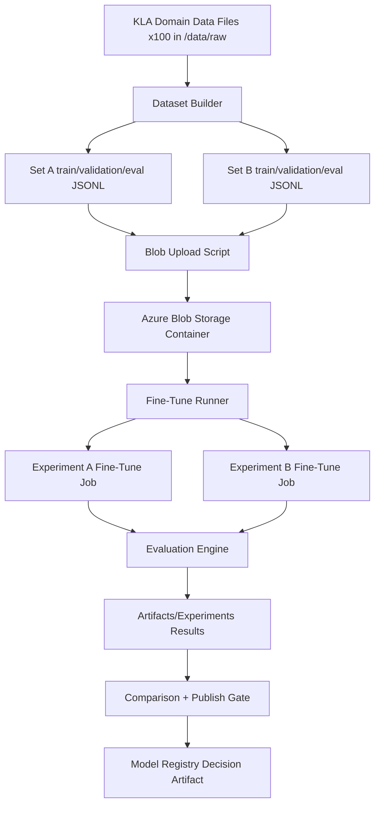

# Foundry-FineTune-BaseModel

POC for KLA showing how to fine-tune an Azure AI Foundry/OpenAI chat base model (`gpt-4.1-mini`) using KLA files, run multiple experiment sets, evaluate outcomes, and gate model publishing with versioned artifacts.

## Architecture



Detailed diagram source: `/docs/architecture.md`

## Repository Structure

- `/data/raw`: 100 generated KLA domain source files
- `/data/sets/set_a|set_b`: train/validation/eval JSONL files for fine-tuning
- `/scripts/generate_kla_data.py`: generates 100 KLA files
- `/scripts/build_experiment_sets.py`: creates train/validation/eval splits for multiple sets
- `/scripts/upload_to_blob.py`: MLOps/DevOps blob upload automation
- `/scripts/run_finetune_experiments.py`: Foundry fine-tuning + evaluation pipeline
- `/scripts/compare_experiment_results.py`: compares experiment metrics and writes publish decision
- `/artifacts/datasets/manifest.json`: dataset versioning/lineage
- `/artifacts/experiments/*`: per-experiment outputs and summary
- `/artifacts/model_registry/decision.json`: publish/no-publish gate decision

## End-to-End Flow

1. Generate 100 KLA files
2. Build two dataset versions (`kla-v1`, `kla-v2`) with train/validation/eval splits
3. Upload split files to Azure Blob Storage
4. Pull split files from blob and run fine-tune jobs on `gpt-4.1-mini`
5. Evaluate baseline vs tuned models on eval split
6. Version and persist all outputs in `/artifacts`
7. Compare experiments and publish only if quality threshold is met

## Setup

```bash
python -m venv .venv
source .venv/bin/activate
pip install -r requirements.txt
cp configs/azure.env.template .env
# fill .env values
set -a && source .env && set +a
```

## Run

```bash
python scripts/generate_kla_data.py
python scripts/build_experiment_sets.py
python scripts/upload_to_blob.py
python scripts/run_finetune_experiments.py
python scripts/compare_experiment_results.py
```

Or one command:

```bash
./scripts/run_all.sh
```

## Version Control of Model, Data, and Evaluation

- **Training data versions**: `kla-v1`, `kla-v2` in config + `artifacts/datasets/manifest.json`
- **Fine-tune runs**: persisted under `artifacts/experiments/<set>/result.json`
- **Evaluation comparison**: `artifacts/experiments/summary.json`
- **Publish decision**: `artifacts/model_registry/decision.json`

## How Publish Decision Works

- Script picks experiment with highest metric delta (`tuned - baseline`)
- If `delta >= 0.05`, model is marked `publish=true`
- Otherwise, model is not published and more data iteration is required

Current sample artifact decision selects `set_b` for publication.
