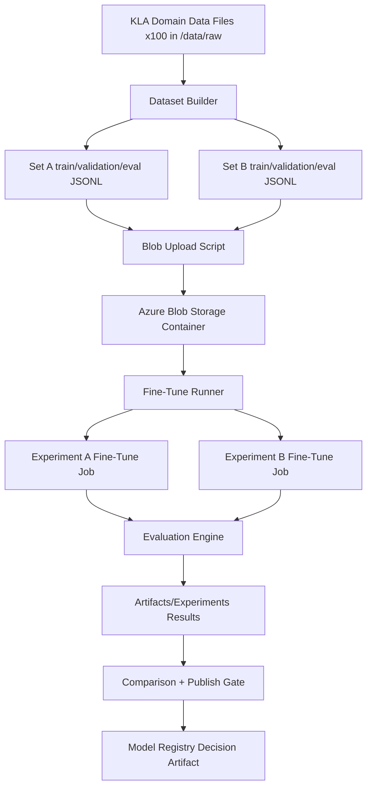

# Foundry-FineTune-BaseModel

POC for KLA showing how to fine-tune an Azure AI Foundry/OpenAI chat base model (`gpt-4.1-mini`) using KLA files, run multiple experiment sets, evaluate outcomes, and gate model publishing with versioned artifacts.

## Architecture



Detailed diagram source: `/docs/architecture.md`

## Repository Structure

- `/data/raw`: 100 generated KLA domain source files
- `/data/sets/set_a|set_b`: train/validation/eval JSONL files for fine-tuning
- `/scripts/generate_kla_data.py`: generates 100 KLA files
- `/scripts/build_experiment_sets.py`: creates train/validation/eval splits for multiple sets
- `/scripts/upload_to_blob.py`: MLOps/DevOps blob upload automation
- `/scripts/run_finetune_experiments.py`: Foundry fine-tuning + evaluation pipeline
- `/scripts/compare_experiment_results.py`: compares experiment metrics and writes publish decision
- `/artifacts/datasets/manifest.json`: dataset versioning/lineage
- `/artifacts/experiments/*`: per-experiment outputs and summary
- `/artifacts/model_registry/decision.json`: publish/no-publish gate decision

## End-to-End Flow

1. Generate 100 KLA files
2. Build two dataset versions (`kla-v1`, `kla-v2`) with train/validation/eval splits
3. Upload split files to Azure Blob Storage
4. Pull split files from blob and run fine-tune jobs on `gpt-4.1-mini`
5. Evaluate baseline vs tuned models on eval split
6. Version and persist all outputs in `/artifacts`
7. Compare experiments and publish only if quality threshold is met

## Setup

### Prerequisites

- Python 3.10+
- Azure CLI (`az`) installed and logged in
- An Azure subscription with the resources listed below

### Azure Resource Details

| Resource | Value |
|---|---|
| Subscription | `86b37969-9445-49cf-b03f-d8866235171c` |
| Resource Group | `ai-myaacoub` |
| Storage Account | `aistoragemyaacoub` |
| Storage Account URL | `https://aistoragemyaacoub.blob.core.windows.net` |
| Blob Container | `kla-finetune` |
| Azure OpenAI Endpoint | `https://001-ai-poc.openai.azure.com/openai/v1` |
| OpenAI Resource | `001-ai-poc` (in resource group `ai-myaacoub`) |
| Base Model | `gpt-4.1-mini` |

### 1. Create the Blob Container (if it doesn't exist)

```bash
az storage container create \
  --name kla-finetune \
  --account-name aistoragemyaacoub \
  --auth-mode login
```

### 2. Set Up Managed Identity & RBAC for Blob Storage

The application uses `DefaultAzureCredential` from `azure-identity`, which supports:
- **Local development**: your Azure CLI / VS Code login
- **CI/CD or VM**: a system-assigned or user-assigned managed identity

#### Grant your user (local development) the Storage Blob Data Contributor role:

```bash
# Get your signed-in user Object ID
USER_OBJECT_ID=$(az ad signed-in-user show --query id -o tsv)

# Assign Storage Blob Data Contributor on the storage account
az role assignment create \
  --assignee "$USER_OBJECT_ID" \
  --role "Storage Blob Data Contributor" \
  --scope "/subscriptions/86b37969-9445-49cf-b03f-d8866235171c/resourceGroups/ai-myaacoub/providers/Microsoft.Storage/storageAccounts/aistoragemyaacoub"
```

#### (Optional) Grant a Managed Identity the same role (for VM / App Service / Container Apps):

```bash
# Replace <MANAGED_IDENTITY_PRINCIPAL_ID> with the principal ID of the managed identity
az role assignment create \
  --assignee "<MANAGED_IDENTITY_PRINCIPAL_ID>" \
  --role "Storage Blob Data Contributor" \
  --scope "/subscriptions/86b37969-9445-49cf-b03f-d8866235171c/resourceGroups/ai-myaacoub/providers/Microsoft.Storage/storageAccounts/aistoragemyaacoub"
```

### 3. Set Up Managed Identity & RBAC for Azure OpenAI

The application authenticates to Azure OpenAI using `DefaultAzureCredential` with the `https://cognitiveservices.azure.com/.default` token scope. No API keys are needed.

#### Grant your user the Cognitive Services OpenAI User role:

```bash
USER_OBJECT_ID=$(az ad signed-in-user show --query id -o tsv)

az role assignment create \
  --assignee "$USER_OBJECT_ID" \
  --role "Cognitive Services OpenAI User" \
  --scope "/subscriptions/86b37969-9445-49cf-b03f-d8866235171c/resourceGroups/ai-myaacoub/providers/Microsoft.CognitiveServices/accounts/001-ai-poc"
```

> **Note**: If the application also needs to create fine-tuning jobs and manage deployments, use the broader **Cognitive Services OpenAI Contributor** role instead:
>
> ```bash
> az role assignment create \
>   --assignee "$USER_OBJECT_ID" \
>   --role "Cognitive Services OpenAI Contributor" \
>   --scope "/subscriptions/86b37969-9445-49cf-b03f-d8866235171c/resourceGroups/ai-myaacoub/providers/Microsoft.CognitiveServices/accounts/001-ai-poc"
> ```

#### (Optional) Grant a Managed Identity the same role:

```bash
az role assignment create \
  --assignee "<MANAGED_IDENTITY_PRINCIPAL_ID>" \
  --role "Cognitive Services OpenAI Contributor" \
  --scope "/subscriptions/86b37969-9445-49cf-b03f-d8866235171c/resourceGroups/ai-myaacoub/providers/Microsoft.CognitiveServices/accounts/001-ai-poc"
```

### 4. Configure Environment Variables

```bash
python -m venv .venv
source .venv/bin/activate   # On Windows: .venv\Scripts\activate
pip install -r requirements.txt
cp configs/azure.env.template .env
```

Edit `.env` — no secrets are required, only resource URLs:

```ini
AZURE_STORAGE_ACCOUNT_URL=https://aistoragemyaacoub.blob.core.windows.net
AZURE_STORAGE_CONTAINER=kla-finetune
AZURE_OPENAI_ENDPOINT=https://001-ai-poc.openai.azure.com/openai/v1
AZURE_OPENAI_API_VERSION=2024-10-21
BASE_MODEL=gpt-4.1-mini
BASELINE_MODEL=gpt-4.1-mini
```

Then load them:

```bash
set -a && source .env && set +a
```

### 5. Verify Access

```bash
# Verify blob storage access
az storage blob list \
  --container-name kla-finetune \
  --account-name aistoragemyaacoub \
  --auth-mode login \
  --output table

# Verify OpenAI access (list models)
az cognitiveservices account list-models \
  --name 001-ai-poc \
  --resource-group ai-myaacoub \
  --output table
```

### Authentication Flow Summary

```
Application
  └─ DefaultAzureCredential
       ├─ Local dev  → Azure CLI credential (az login)
       ├─ VS Code    → VS Code credential
       ├─ CI/CD      → Environment / Workload Identity credential
       └─ Azure VM   → Managed Identity credential
            │
            ├──► Azure Blob Storage  (role: Storage Blob Data Contributor)
            └──► Azure OpenAI        (role: Cognitive Services OpenAI Contributor)
```

## Run

```bash
python scripts/generate_kla_data.py
python scripts/build_experiment_sets.py
python scripts/upload_to_blob.py
python scripts/run_finetune_experiments.py
python scripts/compare_experiment_results.py
```

Or one command:

```bash
./scripts/run_all.sh
```

## Version Control of Model, Data, and Evaluation

- **Training data versions**: `kla-v1`, `kla-v2` in config + `artifacts/datasets/manifest.json`
- **Fine-tune runs**: persisted under `artifacts/experiments/<set>/result.json`
- **Evaluation comparison**: `artifacts/experiments/summary.json`
- **Publish decision**: `artifacts/model_registry/decision.json`

## How Publish Decision Works

- Script picks experiment with highest metric delta (`tuned - baseline`)
- If `delta >= 0.05`, model is marked `publish=true`
- Otherwise, model is not published and more data iteration is required

Current sample artifact decision selects `set_b` for publication.
