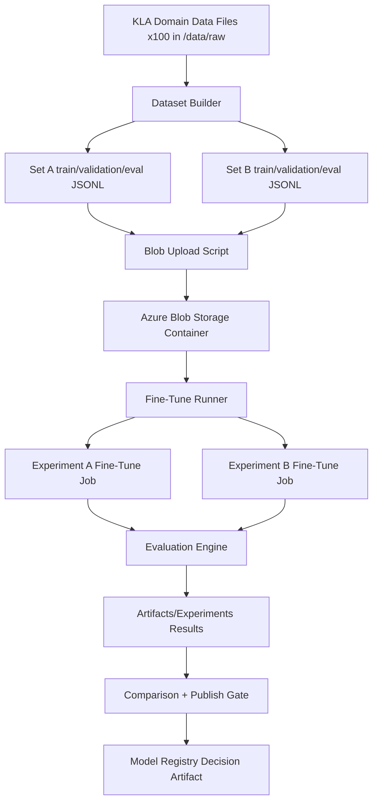

# Architecture Diagram

```mermaid
flowchart TD
    A[KLA Domain Data Files x100 in /data/raw] --> B[Dataset Builder]
    B --> C1[Set A train/validation/eval JSONL]
    B --> C2[Set B train/validation/eval JSONL]
    C1 --> D[Blob Upload Script]
    C2 --> D
    D --> E[Azure Blob Storage Container]
    E --> F[Fine-Tune Runner]
    F --> G1[Experiment A Fine-Tune Job]
    F --> G2[Experiment B Fine-Tune Job]
    G1 --> H[Evaluation Engine]
    G2 --> H
    H --> I[Artifacts/Experiments Results]
    I --> J[Comparison + Publish Gate]
    J --> K[Model Registry Decision Artifact]
```
